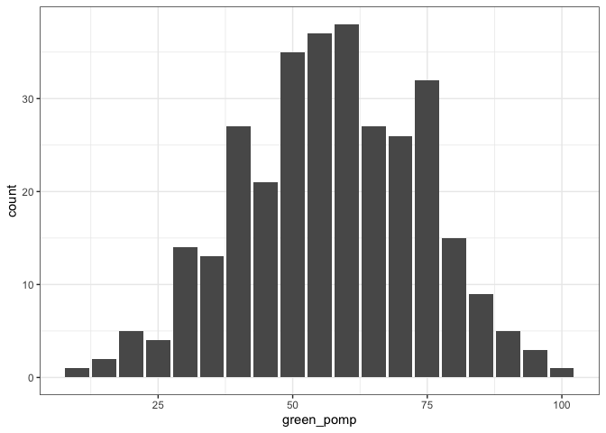
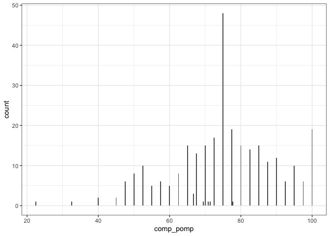
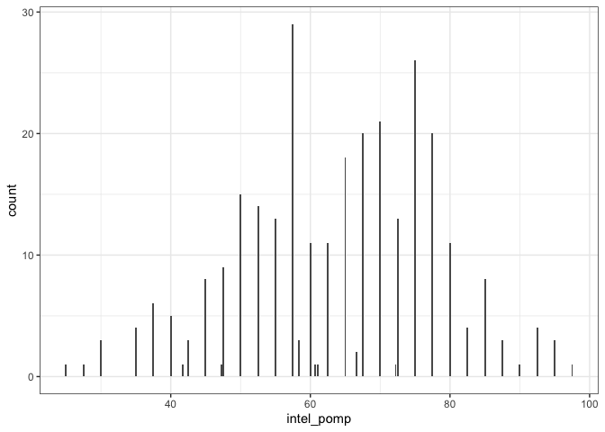
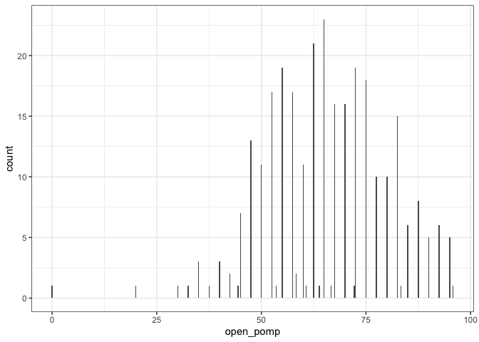
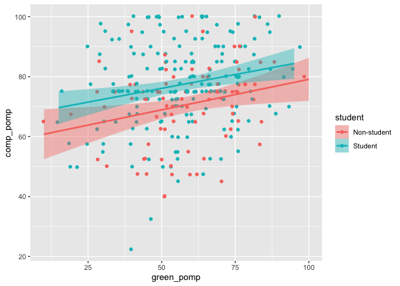
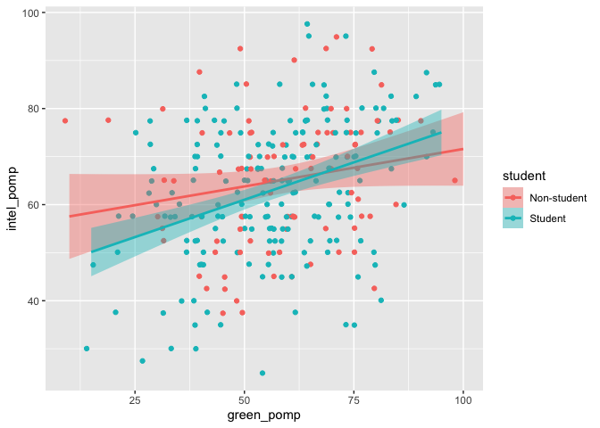
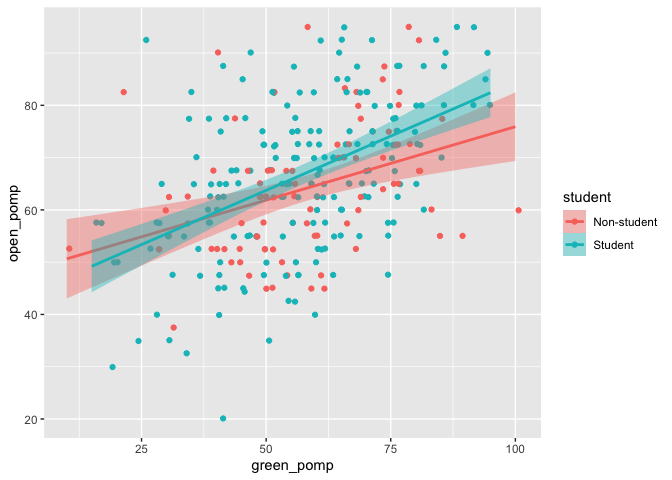
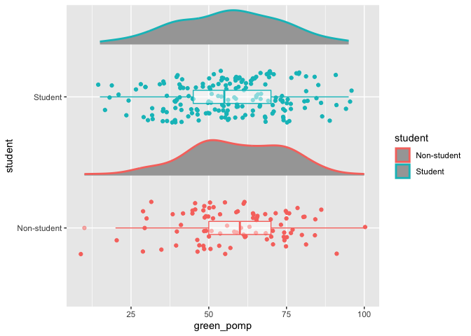

Homework 3
================
Sam Shinde
2/24/2021

# Homework 03

You will analyze data looking at the relationship between **green
reputation** and three personality traits–**compassion**, **intellectual
curiosity**, and **openness to experiences**. The dataset includes data
from **students** and **non-students**.

``` r
dictionary <- readr::read_csv("green_dictionary.csv")
```

    ## 
    ## ── Column specification ────────────────────────────────────────────────────────
    ## cols(
    ##   Item = col_character(),
    ##   Content = col_character(),
    ##   Options = col_character(),
    ##   Keying = col_double()
    ## )

``` r
green_data <- readr::read_csv("green_data.csv")
```

    ## 
    ## ── Column specification ────────────────────────────────────────────────────────
    ## cols(
    ##   .default = col_double(),
    ##   id = col_character()
    ## )
    ## ℹ Use `spec()` for the full column specifications.

``` r
library(tidyverse)
```

    ## ── Attaching packages ─────────────────────────────────────── tidyverse 1.3.0 ──

    ## ✓ ggplot2 3.3.3     ✓ purrr   0.3.4
    ## ✓ tibble  3.0.6     ✓ dplyr   1.0.3
    ## ✓ tidyr   1.1.2     ✓ stringr 1.4.0
    ## ✓ readr   1.4.0     ✓ forcats 0.5.1

    ## ── Conflicts ────────────────────────────────────────── tidyverse_conflicts() ──
    ## x dplyr::filter() masks stats::filter()
    ## x dplyr::lag()    masks stats::lag()

``` r
library(ggdist)
```

For your assignment, do the following.

1.  Inspect the item responses (e.g., with graphs or by summarizing
    distinct values). Is anything unusual?

Based on the printed summary, there are -99 values in the dataset. These
values need to be recoded as missing

``` r
green_data %>%
  summary()
```

    ##       id                green1          green2         green3     
    ##  Length:373         Min.   :1.000   Min.   :1.00   Min.   :1.000  
    ##  Class :character   1st Qu.:3.000   1st Qu.:2.00   1st Qu.:3.000  
    ##  Mode  :character   Median :4.000   Median :3.00   Median :4.000  
    ##                     Mean   :3.476   Mean   :2.93   Mean   :3.797  
    ##                     3rd Qu.:4.000   3rd Qu.:4.00   3rd Qu.:4.000  
    ##                     Max.   :5.000   Max.   :5.00   Max.   :5.000  
    ##                     NA's   :58      NA's   :58     NA's   :58     
    ##      green4          green5          comp1             comp2        
    ##  Min.   :1.000   Min.   :1.000   Min.   :-99.000   Min.   :-99.000  
    ##  1st Qu.:3.000   1st Qu.:2.000   1st Qu.:  4.000   1st Qu.:  4.000  
    ##  Median :3.000   Median :3.000   Median :  4.000   Median :  4.000  
    ##  Mean   :3.238   Mean   :2.835   Mean   :  3.648   Mean   :  3.702  
    ##  3rd Qu.:4.000   3rd Qu.:4.000   3rd Qu.:  4.000   3rd Qu.:  4.500  
    ##  Max.   :5.000   Max.   :5.000   Max.   :  5.000   Max.   :  5.000  
    ##  NA's   :58      NA's   :58      NA's   :86        NA's   :78       
    ##      comp3           comp4             comp5             comp6      
    ##  Min.   :1.000   Min.   :-99.000   Min.   :-99.000   Min.   :1.000  
    ##  1st Qu.:4.000   1st Qu.:  4.000   1st Qu.:  4.000   1st Qu.:2.000  
    ##  Median :4.000   Median :  4.000   Median :  4.000   Median :2.000  
    ##  Mean   :4.267   Mean   :  3.691   Mean   :  3.319   Mean   :2.161  
    ##  3rd Qu.:5.000   3rd Qu.:  4.000   3rd Qu.:  4.000   3rd Qu.:3.000  
    ##  Max.   :5.000   Max.   :  5.000   Max.   :  5.000   Max.   :5.000  
    ##  NA's   :77      NA's   :85        NA's   :88        NA's   :81     
    ##      comp7            comp8             comp9             comp10       
    ##  Min.   :-99.00   Min.   :-99.000   Min.   :-99.000   Min.   :-99.000  
    ##  1st Qu.:  2.00   1st Qu.:  2.000   1st Qu.:  2.000   1st Qu.:  1.000  
    ##  Median :  2.00   Median :  2.000   Median :  2.000   Median :  2.000  
    ##  Mean   :  1.84   Mean   :  1.739   Mean   :  1.342   Mean   :  1.577  
    ##  3rd Qu.:  3.00   3rd Qu.:  2.000   3rd Qu.:  2.000   3rd Qu.:  2.000  
    ##  Max.   :  5.00   Max.   :  5.000   Max.   :  5.000   Max.   :  5.000  
    ##  NA's   :86       NA's   :90        NA's   :89        NA's   :89       
    ##      intel1           intel2            intel3            intel4       
    ##  Min.   :-99.00   Min.   :-99.000   Min.   :-99.000   Min.   :-99.000  
    ##  1st Qu.:  3.00   1st Qu.:  3.000   1st Qu.:  3.000   1st Qu.:  3.000  
    ##  Median :  4.00   Median :  4.000   Median :  4.000   Median :  4.000  
    ##  Mean   :  3.38   Mean   :  3.336   Mean   :  2.822   Mean   :  2.656  
    ##  3rd Qu.:  4.00   3rd Qu.:  4.000   3rd Qu.:  4.000   3rd Qu.:  4.000  
    ##  Max.   :  5.00   Max.   :  5.000   Max.   :  5.000   Max.   :  5.000  
    ##  NA's   :78       NA's   :90        NA's   :86        NA's   :88       
    ##      intel5            intel6            intel7            intel8       
    ##  Min.   :-99.000   Min.   :-99.000   Min.   :-99.000   Min.   :-99.000  
    ##  1st Qu.:  3.000   1st Qu.:  3.000   1st Qu.:  2.000   1st Qu.:  2.000  
    ##  Median :  4.000   Median :  4.000   Median :  2.000   Median :  2.000  
    ##  Mean   :  3.378   Mean   :  3.211   Mean   :  2.101   Mean   :  2.125  
    ##  3rd Qu.:  4.000   3rd Qu.:  4.000   3rd Qu.:  3.000   3rd Qu.:  3.000  
    ##  Max.   :  5.000   Max.   :  5.000   Max.   :  5.000   Max.   :  5.000  
    ##  NA's   :77        NA's   :89        NA's   :86        NA's   :78       
    ##      intel9           intel10            open1             open2        
    ##  Min.   :-99.000   Min.   :-99.000   Min.   :-99.000   Min.   :-99.000  
    ##  1st Qu.:  2.000   1st Qu.:  2.000   1st Qu.:  4.000   1st Qu.:  3.000  
    ##  Median :  2.000   Median :  2.000   Median :  4.000   Median :  4.000  
    ##  Mean   :  2.014   Mean   :  1.809   Mean   :  3.894   Mean   :  3.411  
    ##  3rd Qu.:  4.000   3rd Qu.:  3.000   3rd Qu.:  5.000   3rd Qu.:  4.000  
    ##  Max.   :  5.000   Max.   :  5.000   Max.   :  5.000   Max.   :  5.000  
    ##  NA's   :90        NA's   :90        NA's   :81        NA's   :81       
    ##      open3             open4             open5             open6        
    ##  Min.   :-99.000   Min.   :-99.000   Min.   :-99.000   Min.   :-99.000  
    ##  1st Qu.:  3.000   1st Qu.:  3.000   1st Qu.:  3.000   1st Qu.:  3.000  
    ##  Median :  4.000   Median :  4.000   Median :  4.000   Median :  4.000  
    ##  Mean   :  3.387   Mean   :  3.562   Mean   :  3.109   Mean   :  2.882  
    ##  3rd Qu.:  4.000   3rd Qu.:  5.000   3rd Qu.:  4.000   3rd Qu.:  4.000  
    ##  Max.   :  5.000   Max.   :  5.000   Max.   :  5.000   Max.   :  5.000  
    ##  NA's   :89        NA's   :85        NA's   :88        NA's   :84       
    ##      open7             open8           open9           open10      
    ##  Min.   :-99.000   Min.   :1.000   Min.   :1.000   Min.   :-99.00  
    ##  1st Qu.:  2.000   1st Qu.:2.000   1st Qu.:2.000   1st Qu.:  2.00  
    ##  Median :  3.000   Median :2.000   Median :2.000   Median :  2.00  
    ##  Mean   :  2.274   Mean   :2.599   Mean   :2.568   Mean   :  2.36  
    ##  3rd Qu.:  4.000   3rd Qu.:3.000   3rd Qu.:4.000   3rd Qu.:  4.00  
    ##  Max.   :  5.000   Max.   :5.000   Max.   :5.000   Max.   :  5.00  
    ##  NA's   :85        NA's   :84      NA's   :77      NA's   :90      
    ##     student       
    ##  Min.   :-99.000  
    ##  1st Qu.:  1.000  
    ##  Median :  2.000  
    ##  Mean   :  1.309  
    ##  3rd Qu.:  2.000  
    ##  Max.   :  2.000  
    ##  NA's   :95

The na\_if function coverts values to “NA”

``` r
green_data <- green_data %>%
  na_if("-99")
```

The new set of data does not have any -99 values

``` r
green_data %>%
  summary()
```

    ##       id                green1          green2         green3     
    ##  Length:373         Min.   :1.000   Min.   :1.00   Min.   :1.000  
    ##  Class :character   1st Qu.:3.000   1st Qu.:2.00   1st Qu.:3.000  
    ##  Mode  :character   Median :4.000   Median :3.00   Median :4.000  
    ##                     Mean   :3.476   Mean   :2.93   Mean   :3.797  
    ##                     3rd Qu.:4.000   3rd Qu.:4.00   3rd Qu.:4.000  
    ##                     Max.   :5.000   Max.   :5.00   Max.   :5.000  
    ##                     NA's   :58      NA's   :58     NA's   :58     
    ##      green4          green5          comp1           comp2      
    ##  Min.   :1.000   Min.   :1.000   Min.   :1.000   Min.   :1.000  
    ##  1st Qu.:3.000   1st Qu.:2.000   1st Qu.:4.000   1st Qu.:4.000  
    ##  Median :3.000   Median :3.000   Median :4.000   Median :4.000  
    ##  Mean   :3.238   Mean   :2.835   Mean   :4.007   Mean   :4.051  
    ##  3rd Qu.:4.000   3rd Qu.:4.000   3rd Qu.:4.000   3rd Qu.:4.750  
    ##  Max.   :5.000   Max.   :5.000   Max.   :5.000   Max.   :5.000  
    ##  NA's   :58      NA's   :58      NA's   :87      NA's   :79     
    ##      comp3           comp4           comp5           comp6      
    ##  Min.   :1.000   Min.   :1.000   Min.   :1.000   Min.   :1.000  
    ##  1st Qu.:4.000   1st Qu.:4.000   1st Qu.:4.000   1st Qu.:2.000  
    ##  Median :4.000   Median :4.000   Median :4.000   Median :2.000  
    ##  Mean   :4.267   Mean   :4.049   Mean   :4.042   Mean   :2.161  
    ##  3rd Qu.:5.000   3rd Qu.:4.000   3rd Qu.:4.000   3rd Qu.:3.000  
    ##  Max.   :5.000   Max.   :5.000   Max.   :5.000   Max.   :5.000  
    ##  NA's   :77      NA's   :86      NA's   :90      NA's   :81     
    ##      comp7           comp8           comp9           comp10     
    ##  Min.   :1.000   Min.   :1.000   Min.   :1.000   Min.   :1.000  
    ##  1st Qu.:2.000   1st Qu.:2.000   1st Qu.:2.000   1st Qu.:1.000  
    ##  Median :2.000   Median :2.000   Median :2.000   Median :2.000  
    ##  Mean   :2.192   Mean   :2.096   Mean   :2.053   Mean   :1.933  
    ##  3rd Qu.:3.000   3rd Qu.:2.000   3rd Qu.:2.000   3rd Qu.:2.000  
    ##  Max.   :5.000   Max.   :5.000   Max.   :5.000   Max.   :5.000  
    ##  NA's   :87      NA's   :91      NA's   :91      NA's   :90     
    ##      intel1          intel2          intel3          intel4     
    ##  Min.   :1.000   Min.   :1.000   Min.   :1.000   Min.   :1.000  
    ##  1st Qu.:3.000   1st Qu.:3.000   1st Qu.:3.000   1st Qu.:3.000  
    ##  Median :4.000   Median :4.000   Median :4.000   Median :4.000  
    ##  Mean   :3.728   Mean   :3.699   Mean   :3.537   Mean   :3.375  
    ##  3rd Qu.:4.000   3rd Qu.:4.000   3rd Qu.:4.000   3rd Qu.:4.000  
    ##  Max.   :5.000   Max.   :5.000   Max.   :5.000   Max.   :5.000  
    ##  NA's   :79      NA's   :91      NA's   :88      NA's   :90     
    ##      intel5          intel6          intel7          intel8     
    ##  Min.   :1.000   Min.   :1.000   Min.   :1.000   Min.   :1.000  
    ##  1st Qu.:3.000   1st Qu.:3.000   1st Qu.:2.000   1st Qu.:2.000  
    ##  Median :4.000   Median :4.000   Median :2.000   Median :2.000  
    ##  Mean   :3.725   Mean   :3.572   Mean   :2.455   Mean   :2.469  
    ##  3rd Qu.:4.000   3rd Qu.:4.000   3rd Qu.:3.000   3rd Qu.:3.000  
    ##  Max.   :5.000   Max.   :5.000   Max.   :5.000   Max.   :5.000  
    ##  NA's   :78      NA's   :90      NA's   :87      NA's   :79     
    ##      intel9         intel10          open1           open2      
    ##  Min.   :1.000   Min.   :1.000   Min.   :1.000   Min.   :1.000  
    ##  1st Qu.:2.000   1st Qu.:2.000   1st Qu.:4.000   1st Qu.:3.000  
    ##  Median :2.000   Median :2.000   Median :4.000   Median :4.000  
    ##  Mean   :2.733   Mean   :2.527   Mean   :4.247   Mean   :3.763  
    ##  3rd Qu.:4.000   3rd Qu.:3.000   3rd Qu.:5.000   3rd Qu.:4.000  
    ##  Max.   :5.000   Max.   :5.000   Max.   :5.000   Max.   :5.000  
    ##  NA's   :92      NA's   :92      NA's   :82      NA's   :82     
    ##      open3           open4          open5          open6           open7      
    ##  Min.   :1.000   Min.   :1.00   Min.   :1.00   Min.   :1.000   Min.   :1.000  
    ##  1st Qu.:3.000   1st Qu.:3.00   1st Qu.:3.00   1st Qu.:3.000   1st Qu.:2.000  
    ##  Median :4.000   Median :4.00   Median :4.00   Median :4.000   Median :3.000  
    ##  Mean   :3.749   Mean   :3.92   Mean   :3.83   Mean   :3.592   Mean   :2.983  
    ##  3rd Qu.:4.000   3rd Qu.:5.00   3rd Qu.:4.00   3rd Qu.:4.000   3rd Qu.:4.000  
    ##  Max.   :5.000   Max.   :5.00   Max.   :5.00   Max.   :5.000   Max.   :5.000  
    ##  NA's   :90      NA's   :86     NA's   :90     NA's   :86      NA's   :87     
    ##      open8           open9           open10        student     
    ##  Min.   :1.000   Min.   :1.000   Min.   :1.00   Min.   :1.000  
    ##  1st Qu.:2.000   1st Qu.:2.000   1st Qu.:2.00   1st Qu.:1.000  
    ##  Median :2.000   Median :2.000   Median :2.00   Median :2.000  
    ##  Mean   :2.599   Mean   :2.568   Mean   :2.72   Mean   :1.671  
    ##  3rd Qu.:3.000   3rd Qu.:4.000   3rd Qu.:4.00   3rd Qu.:2.000  
    ##  Max.   :5.000   Max.   :5.000   Max.   :5.00   Max.   :2.000  
    ##  NA's   :84      NA's   :77      NA's   :91     NA's   :96

1.  Compute total scores for the four scales. Recode variables as
    needed.

Some of the items are reverse coded, so they must be recoded.
Additionally, the student variable needs to be recorded as a factor.

``` r
reversed <- dictionary %>%
  filter(Keying == -1) %>%
  pull(Item)

green_data <- green_data %>%
  mutate(
    across(all_of(reversed),
           ~ recode(.x, "1" = 5, "2" = 4, "4" = 2, "5" = 1),
           .names = "{.col}r"))

green_data$student <- recode_factor(green_data$student, '1' = "Non-student", '2' = "Student")

print(green_data)
```

    ## # A tibble: 373 x 51
    ##    id    green1 green2 green3 green4 green5 comp1 comp2 comp3 comp4 comp5 comp6
    ##    <chr>  <dbl>  <dbl>  <dbl>  <dbl>  <dbl> <dbl> <dbl> <dbl> <dbl> <dbl> <dbl>
    ##  1 9099       4      2      5      4      3     2     5     4     4     2     2
    ##  2 6275       3      5      3      3      1     4     5     4     5     5     1
    ##  3 8116       4      2      5      4      3     4     5     5     4     5     1
    ##  4 8586       4      3      5      4      3     4     5     5     4     5     1
    ##  5 0406       3      2      4      4      4     4     4     4     4     4     2
    ##  6 5645       4      3      4      4      3     5     5     5     4     4     2
    ##  7 3788       1      1      1      1      1     3     3     3     3     3     3
    ##  8 8424       4      3      2      2      2     1     1     1     2     2     4
    ##  9 8450       4      2      3      5      2     4     4     4     4     4     1
    ## 10 0512       4      2      5      5      4     5     2     5     4     2     2
    ## # … with 363 more rows, and 39 more variables: comp7 <dbl>, comp8 <dbl>,
    ## #   comp9 <dbl>, comp10 <dbl>, intel1 <dbl>, intel2 <dbl>, intel3 <dbl>,
    ## #   intel4 <dbl>, intel5 <dbl>, intel6 <dbl>, intel7 <dbl>, intel8 <dbl>,
    ## #   intel9 <dbl>, intel10 <dbl>, open1 <dbl>, open2 <dbl>, open3 <dbl>,
    ## #   open4 <dbl>, open5 <dbl>, open6 <dbl>, open7 <dbl>, open8 <dbl>,
    ## #   open9 <dbl>, open10 <dbl>, student <fct>, green2r <dbl>, comp6r <dbl>,
    ## #   comp7r <dbl>, comp8r <dbl>, comp9r <dbl>, comp10r <dbl>, intel7r <dbl>,
    ## #   intel8r <dbl>, intel9r <dbl>, intel10r <dbl>, open7r <dbl>, open8r <dbl>,
    ## #   open9r <dbl>, open10r <dbl>

The following formulas calculate the average mean of the total scores in
each category

``` r
green_data <- green_data %>% 
  rowwise() %>% 
  mutate(
    .id = id,
    green_total = mean(c(green1, green2r, green3, green4, green5), na.rm = TRUE),
    comp_total = mean(c(comp1, comp2, comp3, comp4, comp5, comp6r, comp7r, comp8r, comp9r, comp10r), na.rm = TRUE),
    intel_total = mean(c(intel1, intel2, intel3, intel4, intel5, intel6, intel7r, intel8r, intel9r, intel10r), na.rm = TRUE),
    open_total = mean(c(open1, open2, open3, open4, open5, open6, open7r, open8r, open9r, open10r), na.rm = TRUE))
```

1.  Rescale the variables so that they go from 0-100 instead of the
    original range. Name the recaled variables `*_pomp`.

The score values must be recoded to be on a 0-100 scale. Then we can
calculate the mean for each category.

``` r
green_data <- 
  green_data %>% 
  rowwise() %>% 
  mutate(
    across(c(green1:open10r),
    ~ recode(.x, "1" = 0, "2" = 25, "3" = 50, "4" = 75, "5" = 100),
    .names = "{.col}_pomp"))

green_data <- 
  green_data %>% 
  rowwise() %>% 
  mutate(
    green_pomp = mean(c(green1_pomp,green2r_pomp,green3_pomp,green4_pomp,green5_pomp), na.rm = TRUE),
    comp_pomp = mean(c(comp1_pomp,comp2_pomp,comp3_pomp,comp4_pomp,comp5_pomp,comp6r_pomp,comp7r_pomp, comp8r_pomp,comp9r_pomp,comp10r_pomp), na.rm = TRUE),
    intel_pomp = mean(c(intel1_pomp,intel2_pomp,intel3_pomp,intel4_pomp,intel5_pomp,intel6_pomp,intel7r_pomp, intel8r_pomp,intel9r_pomp,intel10r_pomp), na.rm = TRUE),
    open_pomp = mean(c(open1_pomp,open2_pomp,open3_pomp,open4_pomp,open5_pomp,open6_pomp,open7r_pomp, open8r_pomp,open9r_pomp,open10r_pomp), na.rm = TRUE)) 
```

1.  Make plots that illustrate the distributions of the 4 POMP-scored
    variables.

Environmental consciousness is normally distributed. Compassion and
openness are skewed right. Intelligence has a bimodal distribution.

``` r
ggplot(green_data) +
  aes(x = green_pomp) +
  geom_bar() +
  theme_bw()
```

    ## Warning: Removed 58 rows containing non-finite values (stat_count).

<!-- -->

``` r
ggplot(green_data) +
  aes(x = comp_pomp) +
  geom_bar() +
  theme_bw()
```

    ## Warning: Removed 77 rows containing non-finite values (stat_count).

<!-- -->

``` r
ggplot(green_data) +
  aes(x = intel_pomp) +
  geom_bar() +
  theme_bw()
```

    ## Warning: Removed 77 rows containing non-finite values (stat_count).

<!-- -->

``` r
ggplot(green_data) +
  aes(x = open_pomp) +
  geom_bar() +
  theme_bw()
```

    ## Warning: Removed 77 rows containing non-finite values (stat_count).

<!-- -->

1.  Make scatterplots showing the relationships between **green
    reputation** and each personality trait. Include trend lines for
    **students** and **non-students**. What do these plots show?

Environmental consciousness is positively correlated with openness,
intelligence, and compassion for both students and non-students.
However, students reported higher levels of compassion and openness
compared to non-students.

``` r
green_data %>% 
  filter(!is.na(student)) %>% 
  ggplot() +
  aes(y = comp_pomp,
      x = green_pomp,
      group = student,
      color = student,
      fill = student) +
  geom_jitter() +
  geom_smooth(method = "lm")
```

    ## `geom_smooth()` using formula 'y ~ x'

<!-- -->

``` r
green_data %>% 
  filter(!is.na(student)) %>% 
  ggplot() +
  aes(y = intel_pomp,
      x = green_pomp,
      group = student,
      color = student,
      fill = student) +
  geom_jitter() +
  geom_smooth(method = "lm")
```

    ## `geom_smooth()` using formula 'y ~ x'

<!-- -->

``` r
green_data %>% 
  filter(!is.na(student)) %>% 
  ggplot() +
  aes(y = open_pomp,
      x = green_pomp,
      group = student,
      color = student,
      fill = student) +
  geom_jitter() +
  geom_smooth(method = "lm")
```

    ## `geom_smooth()` using formula 'y ~ x'

<!-- -->

1.  Compare **green reputation** for students and non-students using a
    **rainfall plot** (bar + density + data points).

Student responses appear to have a normal distribution. Non-student
reponses appear to have a bimodal distribution.

``` r
green_data %>%
  filter(!is.na(student)) %>% 
  ggplot() +
    aes(y = student, x = green_pomp, na.omit, color = student) +
    geom_jitter(height = 0.2) +
    geom_boxplot(alpha = .5,
               width = .1,
               size = .5) +
    ggdist::stat_slab(height = .3,
                      position = position_nudge(y = .4))
```

<!-- -->

1.  Compute a summary table of means, SDs, medians, minima, and maxima
    for the four total scores for students and non-students.

On average, students report higher levels of environmental conciousness
and intelligence compared to non-students. They also report lower levels
of compassion and openness compared to non-students.

``` r
summary_green <- green_data %>% 
  group_by(student) %>% 
  summarize(green_mean = mean(green_pomp),
            green_sd = sd(green_pomp),
            green_median = median(green_pomp),
            green_min = min(green_pomp),
            green_max = max(green_pomp),
            comp_mean = mean(comp_pomp),
            comp_sd = sd(comp_pomp),
            comp_median = median(comp_pomp),
            comp_min = min(comp_pomp),
            comp_max = max(comp_pomp),
            intel_mean = mean(intel_pomp),
            intel_sd = sd(intel_pomp),
            intel_median = median(intel_pomp),
            intel_min = min(intel_pomp),
            intel_max = max(intel_pomp),
            open_mean = mean(open_pomp),
            open_sd = sd(open_pomp),
            open_median = median(open_pomp),
            open_min = min(open_pomp),
            open_max = max(open_pomp))

tibble(summary_green)
```

    ## # A tibble: 3 x 21
    ##   student green_mean green_sd green_median green_min green_max comp_mean comp_sd
    ##   <fct>        <dbl>    <dbl>        <dbl>     <dbl>     <dbl>     <dbl>   <dbl>
    ## 1 Non-st…       58.7     16.5           60        10       100      70.7    13.1
    ## 2 Student       56.4     17.1           55        15        95      77.3    14.6
    ## 3 <NA>         NaN       NA             NA       NaN       NaN     NaN      NA  
    ## # … with 13 more variables: comp_median <dbl>, comp_min <dbl>, comp_max <dbl>,
    ## #   intel_mean <dbl>, intel_sd <dbl>, intel_median <dbl>, intel_min <dbl>,
    ## #   intel_max <dbl>, open_mean <dbl>, open_sd <dbl>, open_median <dbl>,
    ## #   open_min <dbl>, open_max <dbl>
